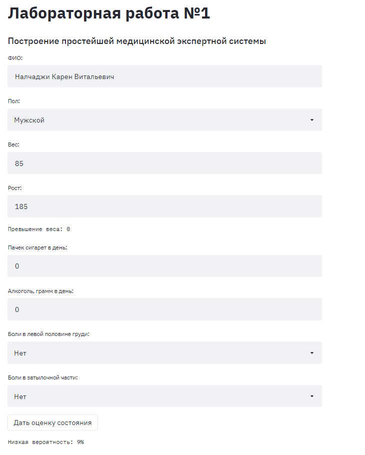

## Построение простейшей медицинской системы:

#### Запуск сервера в консоли:
>streamlit run app.py
    

#### В браузере необходимо открыть:
>http://localhost:8501

#### Вид веб-приложения в браузере:

#### Выход
**Закрыть вкладку в браузере и нажать Ctrl + C в консоли для завершения работы**